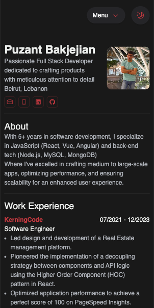
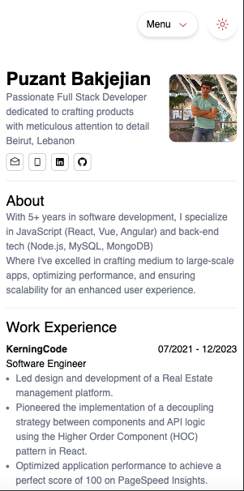

# Puzant CV 💼

[](https://app.netlify.com/sites/puzant-cv/deploys)


**Live demo**: [Puzant CV](http://puzant-cv.netlify.app/)

## Preview
### Desktop


### Mobile

  


Welcome to my CV repository! This project showcases my personal CV in the form of a web page, built with Tailwind CSS, Alpine.js, HTML, and CSS variables. The page includes a dark mode feature for a personalized user experience.

## Features 🚀
- 📱 Responsive Design: The CV is designed to be responsive, ensuring a seamless experience across various devices and screen sizes.
- 🌙 Dark Mode: Enjoy reading my CV in both light and dark modes. Toggle between the modes for a comfortable viewing experience.

## Technologies Used 🤖
- Tailwind CSS: A utility-first CSS framework used for styling.
- Alpine.js: A lightweight JavaScript framework for adding interactivity to web pages.
- HTML: Standard markup language for creating the structure of the web page.
- CSS Variables: Used for managing and maintaining consistent color themes.

## Getting Started
1. Clone the repository:
```
git clone https://github.com/your-username/your-cv-repo.git
```
2. Install the packages
```
npm install
```
3. Run the App
```
npm run dev
```
4. Open the browser & navigate to `localhost:5173`
